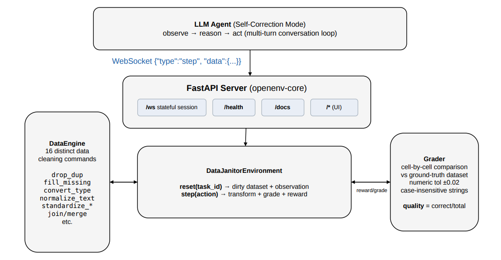

# Data Janitor Env

An OpenEnv environment for training AI agents to clean messy real-world data.

Data scientists spend **80% of their time** on data wrangling — deduplication, type
conversion, format standardization, and reconciliation. This environment turns that
problem into a structured RL task with measurable progress, deterministic grading,
and realistic scenarios drawn from production data pipelines.

## Why This Matters

| Gap | How Data Janitor fills it |
|-----|--------------------------|
| No RL benchmark for data cleaning | 3 tasks across difficulty levels with deterministic graders |
| LLM agents can't practice data ops | 16 transformation commands with rich feedback per step |
| Existing envs are games/toys | Modeled on real employee records, CRM exports, and sales pipelines |

## Action Space

```python
class DataJanitorAction(Action):
    command: str                          # Transformation command
    column: Optional[str] = None          # Target column
    params: Dict[str, Any] = {}           # Command-specific parameters
```

### Available Commands

| Command | Description | Key Params |
|---------|-------------|------------|
| `inspect` | View column or dataset stats | — |
| `drop_duplicates` | Remove duplicate rows | `subset`: list of columns |
| `fill_missing` | Fill null values | `strategy`: mean/median/mode/constant, `value` |
| `drop_nulls` | Drop rows with nulls | — |
| `convert_type` | Cast column type | `target_type`: int/float/str |
| `normalize_text` | Text operations | `operation`: trim/lower/upper/title/regex_replace |
| `standardize_date` | Parse dates to ISO format | `format`: strftime pattern |
| `standardize_phone` | Normalize phone numbers | — |
| `rename_column` | Rename a column | `new_name` |
| `map_values` | Remap values | `mapping`: {old: new} |
| `filter_rows` | Remove rows by condition | `operator`, `value` |
| `split_column` | Split by delimiter | `delimiter`, `new_columns` |
| `merge_columns` | Combine columns | `columns`, `new_column`, `separator` |
| `join` | Merge secondary dataset | `on`, `how`: inner/left |
| `add_column` | Compute new column | `expression`: "col_a * col_b" |
| `submit` | Finalize and score | — |

## Observation Space

```python
class DataJanitorObservation(Observation):
    schema_info: List[ColumnInfo]         # Column names, types, null counts, samples
    sample_rows: List[Dict]               # First 5 rows of current data
    row_count: int                        # Current row count
    quality_score: float                  # 0.0–1.0 grader score vs ground truth
    issues: List[str]                     # Auto-detected problems
    task_description: str                 # What needs to be cleaned
    target_schema: Dict[str, str]         # Expected output column types
    steps_taken: int                      # Steps used so far
    max_steps: int                        # Step budget
    available_commands: List[str]         # Valid commands
    message: str                          # Feedback from last action
    secondary_data_info: Optional[Dict]   # Secondary dataset preview (Task 3)
```

## Tasks

### Task 1: Fix the Basics (Easy)

**Dataset:** 40 employee records (35 unique + 5 duplicates)

**Issues:**
- Duplicate rows
- Ages stored as strings
- Department names with inconsistent casing and abbreviations
- Emails with extra whitespace and uppercase
- Salaries with `$` symbols and commas

**Expected steps:** 4–6 | **Max steps:** 15

### Task 2: Normalize the Chaos (Medium)

**Dataset:** 100 customer contacts (90 unique + 10 duplicates)

**Issues:**
- Signup dates in 5 different formats
- Phone numbers in 6 different formats
- US states as full names vs 2-letter codes
- Names with inconsistent casing
- Zip codes with stripped leading zeros

**Expected steps:** 7–10 | **Max steps:** 20

### Task 3: Pipeline Merge (Hard)

**Dataset:** 80 orders + 30 products (need join)

**Issues:**
- Product ID casing mismatch between tables
- Incorrect totals (don't match quantity × price)
- Non-positive quantities
- Mixed date formats
- Currency symbols in unit prices
- Customer name casing

**Expected steps:** 8–12 | **Max steps:** 30

## Reward Design

**Per-step reward:** Delta in quality score (positive when data improves, negative on regression).

**Final reward (on submit):** Grader score comparing cleaned data to ground truth.

The grader matches rows by primary key and compares cell-by-cell with tolerance
for numeric values (±0.02) and case-insensitive string comparison.

```
quality_score = correct_cells / total_expected_cells
```

This gives continuous signal throughout the episode — not just binary pass/fail.

## Baseline Scores

Measured with the optimal cleaning sequences via the included `inference.py` script against the live HF Space:

| Task | Difficulty | Score |
|------|-----------|-------|
| fix_basics | Easy | **1.0000** |
| normalize_chaos | Medium | **1.0000** |
| pipeline_merge | Hard | **1.0000** |
| **Average** | | **1.0000** |

The environment provides continuous per-step reward signal — agents learn which transformations
move the quality needle, not just whether the final submission passes.

## Architecture




Three tasks of increasing difficulty, all seeded deterministically:
  Task 1 (fix_basics)      — 40 employee records,  15-step budget
  Task 2 (normalize_chaos) — 100 customer contacts, 20-step budget
  Task 3 (pipeline_merge)  — 80 orders + 30 products join, 30-step budget


## Quick Start

### 1. In-Process Gymnasium Interface (no server needed)

```bash
git clone https://huggingface.co/spaces/yaswanth169/data-janitor-env
cd data-janitor-env
pip install -e ".[gym]"
```

```python
from gym_env import DataJanitorGymEnv

# Text mode — for LLM agents
env = DataJanitorGymEnv(task_id="fix_basics", mode="text")
obs, info = env.reset()
print(f"Quality: {info['quality_score']:.2%} | Issues: {len(info['issues'])}")

action = env.action_from_dict("drop_duplicates", params={"subset": ["employee_id"]})
obs, reward, terminated, truncated, info = env.step(action)
print(f"After drop_duplicates: {info['quality_score']:.2%}")
```

```python
# Dict mode — for classical RL (PPO, DQN, Q-learning)
env = DataJanitorGymEnv(task_id="fix_basics", mode="dict")
obs, info = env.reset()     # obs.shape == (8,)
action = env.action_space.sample()
obs, reward, terminated, truncated, info = env.step(action)
```

### 2. Train an RL Agent

```bash
# No extra dependencies needed (Q-table fallback)
python examples/train_rl_agent.py

# With stable-baselines3 (PPO)
pip install stable-baselines3
python examples/train_rl_agent.py
```

### 3. Run an LLM Agent

```bash
export MODEL_NAME="Qwen/Qwen2.5-72B-Instruct"
export HF_TOKEN="your-hf-token"
python examples/llm_agent.py
```

### 4. Server Mode (WebSocket API)

```bash
# Start the server
PYTHONPATH=. uvicorn server.app:app --host 0.0.0.0 --port 7860

# Run the baseline inference script
export MODEL_NAME="your-model"
export HF_TOKEN="your-token"
export ENV_BASE_URL="http://localhost:7860"
python inference.py
```

### 5. Use the Interactive Dashboard

Visit the live HF Space at https://huggingface.co/spaces/yaswanth169/data-janitor-env

The dashboard lets you:
- Select a task and explore the dirty dataset
- Issue cleaning commands via a GUI and watch quality improve in real-time
- Run the built-in baseline agent with one click
- See schema, sample rows, and detected issues

### 6. Docker

```bash
docker build -t data-janitor-env .
docker run -p 7860:7860 data-janitor-env
# Dashboard: http://localhost:7860
# API docs:  http://localhost:7860/docs
# WebSocket: ws://localhost:7860/ws
```

### 7. Use with the OpenEnv Client

```python
from data_janitor_env import DataJanitorEnv, DataJanitorAction

with DataJanitorEnv(base_url="https://yaswanth169-data-janitor-env.hf.space").sync() as env:
    result = env.reset(task_id="fix_basics")
    print(f"Issues: {result.observation.issues}")

    result = env.step(DataJanitorAction(
        command="drop_duplicates",
        params={"subset": ["employee_id"]}
    ))
    print(f"Quality: {result.observation.quality_score:.2%}")

    result = env.step(DataJanitorAction(command="submit"))
    print(f"Final score: {result.reward:.4f}")
```

## Real-World Use Case

Data scientists spend 80% of their time on data wrangling. This environment
trains AI agents to automate that work:

1. **Train** an agent on the environment's 3 tasks
2. **Fine-tune** an LLM using the continuous reward signal
3. **Deploy** the fine-tuned model to your ETL pipeline
4. The model **auto-detects issues** and applies the right transformations
5. Only edge cases escalate to human review — saving hours per dataset

The same RL-trained policy generalises from the training tasks to real
CSV exports, CRM data, and database snapshots with similar cleaning patterns.

## Setup for Development

```bash
git clone https://huggingface.co/spaces/yaswanth169/data-janitor-env
cd data-janitor-env
pip install -e ".[server,inference,gym,dev]"

# Run tests (server must be running)
PYTHONPATH=. uvicorn server.app:app --host 0.0.0.0 --port 7860 &
python tests/test_suite.py

# Deploy to HF Spaces
openenv push --repo-id yaswanth169/data-janitor-env
```

## Project Structure

```
data-janitor-env/
├── gym_env.py             # Gymnasium wrapper (in-process, no server needed)
├── models.py              # Pydantic models (Action, Observation, State)
├── client.py              # WebSocket client (EnvClient subclass)
├── inference.py           # Baseline LLM agent
├── examples/
│   ├── quickstart.py      # 5-minute getting started
│   ├── train_rl_agent.py  # PPO / Q-table RL training
│   └── llm_agent.py       # LLM agent via OpenAI-compat API
├── openenv.yaml           # Environment manifest
├── Dockerfile             # Container definition
├── requirements.txt       # Server dependencies
├── pyproject.toml         # Package configuration
└── server/
    ├── app.py             # FastAPI application
    ├── environment.py     # OpenEnv Environment implementation
    ├── engine.py          # Data transformation engine (16 commands)
    ├── graders.py         # Deterministic grading system
    └── task_data.py       # Seeded dataset generation
```

## License

MIT
